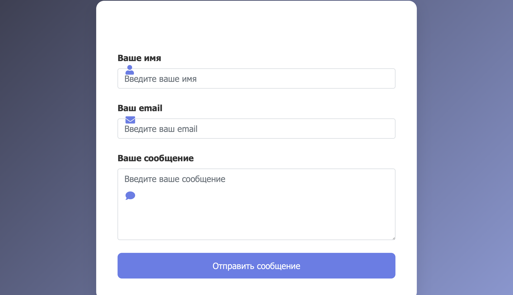

# 🚀 Форма обратной связи с Telegram-уведомлениями



## 🔥 Особенности
- Сохранение данных в MySQL
- Мгновенные уведомления в Telegram
- Валидация данных
- Docker-развертывание

## 🛠 Технологии
| Компонент       | Версия    |
|-----------------|-----------|
| PHP             | 8.2       |
| MySQL           | 8         |
| Bootstrap       | 5         |

## 🚀 Быстрый старт
```bash
docker-compose up -d --build
cat > README.md << 'EOF'
# 🚀 Форма обратной связи с Telegram-уведомлениями


## 🔥 Особенности
- Сохранение данных в MySQL
- Мгновенные уведомления в Telegram
- Валидация данных
- Docker-развертывание

## 🛠 Технологии
| Компонент       | Версия    |
|-----------------|-----------|
| PHP             | 8.2       |
| MySQL           | 8         |
| Bootstrap       | 5         |

## 🚀 Быстрый старт
```bash
docker-compose up -d --build
git add README.md images/
git commit -m "Добавил README и скриншоты"
git push
exit
cat > README.md << 'EOF'
# 🚀 Форма обратной связи с Telegram-уведомлениями
... [весь текст README] ...
